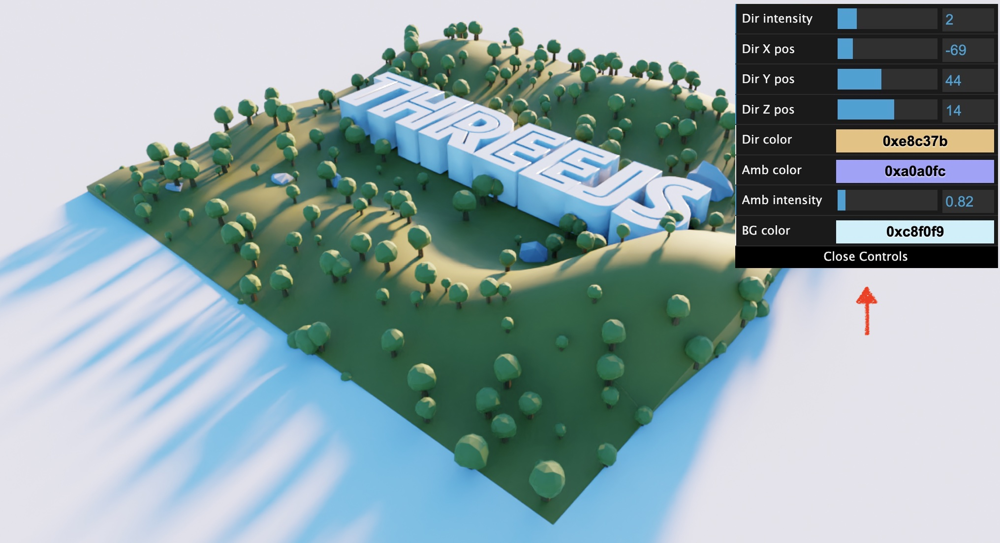

# IMMERSIVE NYC EXPERIENCE
<h4>by Immersive Group</h4>

# Introduction
The website we will be building shows the NY Central Park (3D scene) and the skyscrapers skyline of NYC behind the central park, in which we will include a fictitious skyscraper that is round and plays videos at the top like a round billboard 

Resources: [Threejs](https://threejs.org/), [WebGL](https://github.com/KhronosGroup/WebGL), [webpack](https://webpack.js.org/) , [Babel](https://babeljs.io/ ), [ESLint](https://eslint.org/)


# Getting Started
Download and install Node.js on your computer (https://nodejs.org/en/download/).

Then, open VSCODE, drag the project folder to it. Open VSCODE terminal and install dependencies (you need to do this only in the first time)
```
npm install
```

Run this command in your terminal to open a local server at localhost:8080
```
npm run dev
```

# Debug interface

You can enable a debug interface by getting the contents of "debug.js" file and place it in the end of the main file. This will give you some interface to change things like colors and light position, which can be very useful when you change the model to something else.
